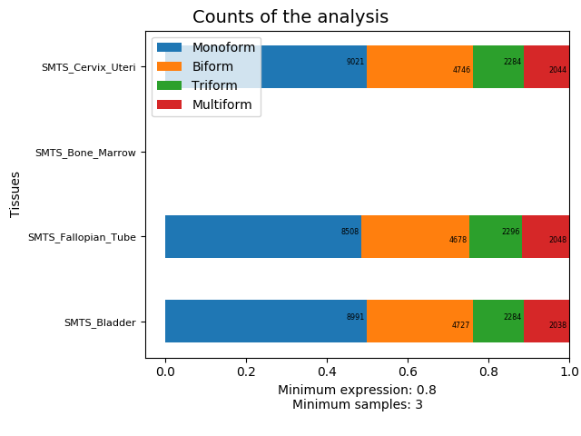
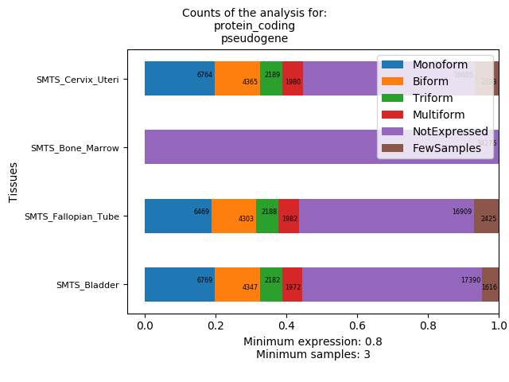

# The all tissues analysis: `all_tissues_analysis.py`

This file contains functions to be able to analyse and represent the same results as TheTissueAnalysis file, but for all tissue files you have in a directory.

These are the all the possible arguments we can use:

| Argument | Type | Default | Description |
|:-|:-:|:-:|:-|
| `--initial_dir` | string | - | The name of the directory where the initial data of all the tissues are saved. |
| `--seqexp` | float | 0.05 | The difference between the `minexp` thresholds you want to compare. As the default is 0.05, the analysis will be done taking into account that `minexp` is 0, 0.05, 0.1, 0.15, ... until 0.95, so there will be 20 analysis for each `minsamps` you wrote in the `--seqnumsamps` argument; if you wrote `--seqexp 0.01`, there will be 100 analysis for each `minsamps` you wrote in the `--seqnumsamps` argument, and so on. |
| `--seqnumsamps` | integer, list of integers | - | A sequence of minimum number of samples (`minsamps`) you want to compare. If you write `--seqnumsamps 1 2 3`, the function you call will analyse the data with a `minsamps` of 1, a `minsamps` of 2 and a `minsamps` of 3. |
| `--ncpus` | integer | 1 | The number of CPUs you will use. |
| `--num_cores` | integer | 1 | The number of cores you will use. |
| `--out_thresdir` | string | AllTissues_Summaries_DifThres | The name of the directory where all the different thresholds tissue summary files will be saved. |
| `--in_thresdir` | string | AllTissues_Summaries_DifThres | The name of the directory where all the different tissue summary files has been saved. Inside this folder, there cannot be anything else but the tissue summary files. |
| `--out_statsdir` | string | AllTissues_Statistics_DifThres | The name of the directory where all the tissue statistics files will be saved. |
| `--in_statsdir` | string | AllTissues_Statistics_DifThres | The name of the directory where all the tissue statistics files have been saved. |
| `--genetype` | string, list of strings | All | The gene types you are interested in. |
| `--drop_tsfiles` | string | `True` | Do you want to remove the tissue summary files? Then, write `--drop_tsfiles` in your call. This is useful when you have a big number of tissue summary files, that could take up gigabytes of memory, and you only want the statistics, not the whole summaries. |
| `--minexp` | float | 0.8 | The minimum expression you want to be explained. Imagine you have a gene with 5 isoforms, and the proportion of each one is 0.18, 0.72, 0.05, 0.02 and 0.13 in one of the samples, respectively. The second isoform explains the 72% of the expression of the gene, which is very high, but maybe you need a minimum of 80% to be explained. In this case, this is what you should write: `--minexp 0.8`. |
| `--minsamps` | integer | 10 | The minimum samples where a gene has to be expressed to take it into account. This threshold is useful when you have a big number of samples. |
| `--expressed` | boolean | `True` | Do you want to draw just the results of the expressed genes? Then, write `--expressed` in your call.  |
| `--plotfile` | string | AllTissuesBarplot*···*.png | The name of the file where the plot will be saved. It can be *.pdf* or *.png*. |

In some of the functions, some of these arguments are mandatory. We will see this for each function.

## Numeric functions

These are the functions that perform the analysis:

- All tissues different thresholds summaries (ATDTSum)
- All tissues different thresholds statistics (ATDTSta)

#### All tissues different thresholds summaries function: `-ATDTSum`

This function uses **Tissue different thresholds summaries function** of the `one_tissue_analysis.py` program to create the tissue summary files for each initial tissue data you have inside one folder, taking the `minexp` and `minsamps` arguments you said. Then, the function creates a folder where it saves all these summaries.

Mandatory arguments:

* `--initial_dir`
* `--seqnumsamps`

Optional arguments:

* `--out_thresdir`
* `--seqexp`
* `--ncpus`
* `--num_cores`

You have to have all the initial data for each tissue inside the `initial_dir` directory you write.

For instance, our folder *AllTissues_Initial2* contains four initial data files, one per tissue:

```bash
$ ls AllTissues_Initial2
SMTS_Bladder.csv.gz  SMTS_Bone_Marrow.csv.gz  SMTS_Cervix_Uteri.csv.gz  SMTS_Fallopian_Tube.csv.gz
```

So, if we put this folder with the `--initial_dir` argument with, for instance, the same `--seqnumsamps` used in the *OneTissueAnalysis* document...

```bash
$ python all_tissues_analysis.py -ATDTSum --initial_dir AllTissues_Initial2/ --seqnumsamps 1 3 5 7
```

This call has created a new folder called *AllTissues_Summaries_DifThres* where it has saved all the summaries:

```bash
$ ls AllTissues_Summaries_DifThres/
SMTS_Bladder_0.000_1.csv  SMTS_Bladder_0.650_5.csv      SMTS_Bone_Marrow_0.350_1.csv   SMTS_Cervix_Uteri_0.000_5.csv  SMTS_Cervix_Uteri_0.700_1.csv    SMTS_Fallopian_Tube_0.350_5.csv
SMTS_Bladder_0.000_3.csv  SMTS_Bladder_0.650_7.csv      SMTS_Bone_Marrow_0.350_3.csv   SMTS_Cervix_Uteri_0.000_7.csv  SMTS_Cervix_Uteri_0.700_3.csv    SMTS_Fallopian_Tube_0.350_7.csv
SMTS_Bladder_0.000_5.csv  SMTS_Bladder_0.700_1.csv      SMTS_Bone_Marrow_0.350_5.csv   SMTS_Cervix_Uteri_0.050_1.csv  SMTS_Cervix_Uteri_0.700_5.csv    SMTS_Fallopian_Tube_0.400_1.csv
SMTS_Bladder_0.000_7.csv  SMTS_Bladder_0.700_3.csv      SMTS_Bone_Marrow_0.350_7.csv   SMTS_Cervix_Uteri_0.050_3.csv  SMTS_Cervix_Uteri_0.700_7.csv    SMTS_Fallopian_Tube_0.400_3.csv
SMTS_Bladder_0.050_1.csv  SMTS_Bladder_0.700_5.csv      SMTS_Bone_Marrow_0.400_1.csv   SMTS_Cervix_Uteri_0.050_5.csv  SMTS_Cervix_Uteri_0.750_1.csv    SMTS_Fallopian_Tube_0.400_5.csv
SMTS_Bladder_0.050_3.csv  SMTS_Bladder_0.700_7.csv      SMTS_Bone_Marrow_0.400_3.csv   SMTS_Cervix_Uteri_0.050_7.csv  SMTS_Cervix_Uteri_0.750_3.csv    SMTS_Fallopian_Tube_0.400_7.csv
SMTS_Bladder_0.050_5.csv  SMTS_Bladder_0.750_1.csv      SMTS_Bone_Marrow_0.400_5.csv   SMTS_Cervix_Uteri_0.100_1.csv  SMTS_Cervix_Uteri_0.750_5.csv    SMTS_Fallopian_Tube_0.450_1.csv
SMTS_Bladder_0.050_7.csv  SMTS_Bladder_0.750_3.csv      SMTS_Bone_Marrow_0.400_7.csv   SMTS_Cervix_Uteri_0.100_3.csv  SMTS_Cervix_Uteri_0.750_7.csv    SMTS_Fallopian_Tube_0.450_3.csv
SMTS_Bladder_0.100_1.csv  SMTS_Bladder_0.750_5.csv      SMTS_Bone_Marrow_0.450_1.csv   SMTS_Cervix_Uteri_0.100_5.csv  SMTS_Cervix_Uteri_0.800_1.csv    SMTS_Fallopian_Tube_0.450_5.csv
SMTS_Bladder_0.100_3.csv  SMTS_Bladder_0.750_7.csv      SMTS_Bone_Marrow_0.450_3.csv   SMTS_Cervix_Uteri_0.100_7.csv  SMTS_Cervix_Uteri_0.800_3.csv    SMTS_Fallopian_Tube_0.450_7.csv
SMTS_Bladder_0.100_5.csv  SMTS_Bladder_0.800_1.csv      SMTS_Bone_Marrow_0.450_5.csv   SMTS_Cervix_Uteri_0.150_1.csv  SMTS_Cervix_Uteri_0.800_5.csv    SMTS_Fallopian_Tube_0.500_1.csv
SMTS_Bladder_0.100_7.csv  SMTS_Bladder_0.800_3.csv      SMTS_Bone_Marrow_0.450_7.csv   SMTS_Cervix_Uteri_0.150_3.csv  SMTS_Cervix_Uteri_0.800_7.csv    SMTS_Fallopian_Tube_0.500_3.csv
SMTS_Bladder_0.150_1.csv  SMTS_Bladder_0.800_5.csv      SMTS_Bone_Marrow_0.500_1.csv   SMTS_Cervix_Uteri_0.150_5.csv  SMTS_Cervix_Uteri_0.850_1.csv    SMTS_Fallopian_Tube_0.500_5.csv
SMTS_Bladder_0.150_3.csv  SMTS_Bladder_0.800_7.csv      SMTS_Bone_Marrow_0.500_3.csv   SMTS_Cervix_Uteri_0.150_7.csv  SMTS_Cervix_Uteri_0.850_3.csv    SMTS_Fallopian_Tube_0.500_7.csv
SMTS_Bladder_0.150_5.csv  SMTS_Bladder_0.850_1.csv      SMTS_Bone_Marrow_0.500_5.csv   SMTS_Cervix_Uteri_0.200_1.csv  SMTS_Cervix_Uteri_0.850_5.csv    SMTS_Fallopian_Tube_0.550_1.csv
SMTS_Bladder_0.150_7.csv  SMTS_Bladder_0.850_3.csv      SMTS_Bone_Marrow_0.500_7.csv   SMTS_Cervix_Uteri_0.200_3.csv  SMTS_Cervix_Uteri_0.850_7.csv    SMTS_Fallopian_Tube_0.550_3.csv
SMTS_Bladder_0.200_1.csv  SMTS_Bladder_0.850_5.csv      SMTS_Bone_Marrow_0.550_1.csv   SMTS_Cervix_Uteri_0.200_5.csv  SMTS_Cervix_Uteri_0.900_1.csv    SMTS_Fallopian_Tube_0.550_5.csv
SMTS_Bladder_0.200_3.csv  SMTS_Bladder_0.850_7.csv      SMTS_Bone_Marrow_0.550_3.csv   SMTS_Cervix_Uteri_0.200_7.csv  SMTS_Cervix_Uteri_0.900_3.csv    SMTS_Fallopian_Tube_0.550_7.csv
SMTS_Bladder_0.200_5.csv  SMTS_Bladder_0.900_1.csv      SMTS_Bone_Marrow_0.550_5.csv   SMTS_Cervix_Uteri_0.250_1.csv  SMTS_Cervix_Uteri_0.900_5.csv    SMTS_Fallopian_Tube_0.600_1.csv
SMTS_Bladder_0.200_7.csv  SMTS_Bladder_0.900_3.csv      SMTS_Bone_Marrow_0.550_7.csv   SMTS_Cervix_Uteri_0.250_3.csv  SMTS_Cervix_Uteri_0.900_7.csv    SMTS_Fallopian_Tube_0.600_3.csv
SMTS_Bladder_0.250_1.csv  SMTS_Bladder_0.900_5.csv      SMTS_Bone_Marrow_0.600_1.csv   SMTS_Cervix_Uteri_0.250_5.csv  SMTS_Cervix_Uteri_0.950_1.csv    SMTS_Fallopian_Tube_0.600_5.csv
SMTS_Bladder_0.250_3.csv  SMTS_Bladder_0.900_7.csv      SMTS_Bone_Marrow_0.600_3.csv   SMTS_Cervix_Uteri_0.250_7.csv  SMTS_Cervix_Uteri_0.950_3.csv    SMTS_Fallopian_Tube_0.600_7.csv
SMTS_Bladder_0.250_5.csv  SMTS_Bladder_0.950_1.csv      SMTS_Bone_Marrow_0.600_5.csv   SMTS_Cervix_Uteri_0.300_1.csv  SMTS_Cervix_Uteri_0.950_5.csv    SMTS_Fallopian_Tube_0.650_1.csv
SMTS_Bladder_0.250_7.csv  SMTS_Bladder_0.950_3.csv      SMTS_Bone_Marrow_0.600_7.csv   SMTS_Cervix_Uteri_0.300_3.csv  SMTS_Cervix_Uteri_0.950_7.csv    SMTS_Fallopian_Tube_0.650_3.csv
SMTS_Bladder_0.300_1.csv  SMTS_Bladder_0.950_5.csv      SMTS_Bone_Marrow_0.650_1.csv   SMTS_Cervix_Uteri_0.300_5.csv  SMTS_Fallopian_Tube_0.000_1.csv  SMTS_Fallopian_Tube_0.650_5.csv
SMTS_Bladder_0.300_3.csv  SMTS_Bladder_0.950_7.csv      SMTS_Bone_Marrow_0.650_3.csv   SMTS_Cervix_Uteri_0.300_7.csv  SMTS_Fallopian_Tube_0.000_3.csv  SMTS_Fallopian_Tube_0.650_7.csv
SMTS_Bladder_0.300_5.csv  SMTS_Bone_Marrow_0.000_1.csv  SMTS_Bone_Marrow_0.650_5.csv   SMTS_Cervix_Uteri_0.350_1.csv  SMTS_Fallopian_Tube_0.000_5.csv  SMTS_Fallopian_Tube_0.700_1.csv
SMTS_Bladder_0.300_7.csv  SMTS_Bone_Marrow_0.000_3.csv  SMTS_Bone_Marrow_0.650_7.csv   SMTS_Cervix_Uteri_0.350_3.csv  SMTS_Fallopian_Tube_0.000_7.csv  SMTS_Fallopian_Tube_0.700_3.csv
SMTS_Bladder_0.350_1.csv  SMTS_Bone_Marrow_0.000_5.csv  SMTS_Bone_Marrow_0.700_1.csv   SMTS_Cervix_Uteri_0.350_5.csv  SMTS_Fallopian_Tube_0.050_1.csv  SMTS_Fallopian_Tube_0.700_5.csv
SMTS_Bladder_0.350_3.csv  SMTS_Bone_Marrow_0.000_7.csv  SMTS_Bone_Marrow_0.700_3.csv   SMTS_Cervix_Uteri_0.350_7.csv  SMTS_Fallopian_Tube_0.050_3.csv  SMTS_Fallopian_Tube_0.700_7.csv
SMTS_Bladder_0.350_5.csv  SMTS_Bone_Marrow_0.050_1.csv  SMTS_Bone_Marrow_0.700_5.csv   SMTS_Cervix_Uteri_0.400_1.csv  SMTS_Fallopian_Tube_0.050_5.csv  SMTS_Fallopian_Tube_0.750_1.csv
SMTS_Bladder_0.350_7.csv  SMTS_Bone_Marrow_0.050_3.csv  SMTS_Bone_Marrow_0.700_7.csv   SMTS_Cervix_Uteri_0.400_3.csv  SMTS_Fallopian_Tube_0.050_7.csv  SMTS_Fallopian_Tube_0.750_3.csv
SMTS_Bladder_0.400_1.csv  SMTS_Bone_Marrow_0.050_5.csv  SMTS_Bone_Marrow_0.750_1.csv   SMTS_Cervix_Uteri_0.400_5.csv  SMTS_Fallopian_Tube_0.100_1.csv  SMTS_Fallopian_Tube_0.750_5.csv
SMTS_Bladder_0.400_3.csv  SMTS_Bone_Marrow_0.050_7.csv  SMTS_Bone_Marrow_0.750_3.csv   SMTS_Cervix_Uteri_0.400_7.csv  SMTS_Fallopian_Tube_0.100_3.csv  SMTS_Fallopian_Tube_0.750_7.csv
SMTS_Bladder_0.400_5.csv  SMTS_Bone_Marrow_0.100_1.csv  SMTS_Bone_Marrow_0.750_5.csv   SMTS_Cervix_Uteri_0.450_1.csv  SMTS_Fallopian_Tube_0.100_5.csv  SMTS_Fallopian_Tube_0.800_1.csv
SMTS_Bladder_0.400_7.csv  SMTS_Bone_Marrow_0.100_3.csv  SMTS_Bone_Marrow_0.750_7.csv   SMTS_Cervix_Uteri_0.450_3.csv  SMTS_Fallopian_Tube_0.100_7.csv  SMTS_Fallopian_Tube_0.800_3.csv
SMTS_Bladder_0.450_1.csv  SMTS_Bone_Marrow_0.100_5.csv  SMTS_Bone_Marrow_0.800_1.csv   SMTS_Cervix_Uteri_0.450_5.csv  SMTS_Fallopian_Tube_0.150_1.csv  SMTS_Fallopian_Tube_0.800_5.csv
SMTS_Bladder_0.450_3.csv  SMTS_Bone_Marrow_0.100_7.csv  SMTS_Bone_Marrow_0.800_3.csv   SMTS_Cervix_Uteri_0.450_7.csv  SMTS_Fallopian_Tube_0.150_3.csv  SMTS_Fallopian_Tube_0.800_7.csv
SMTS_Bladder_0.450_5.csv  SMTS_Bone_Marrow_0.150_1.csv  SMTS_Bone_Marrow_0.800_5.csv   SMTS_Cervix_Uteri_0.500_1.csv  SMTS_Fallopian_Tube_0.150_5.csv  SMTS_Fallopian_Tube_0.850_1.csv
SMTS_Bladder_0.450_7.csv  SMTS_Bone_Marrow_0.150_3.csv  SMTS_Bone_Marrow_0.800_7.csv   SMTS_Cervix_Uteri_0.500_3.csv  SMTS_Fallopian_Tube_0.150_7.csv  SMTS_Fallopian_Tube_0.850_3.csv
SMTS_Bladder_0.500_1.csv  SMTS_Bone_Marrow_0.150_5.csv  SMTS_Bone_Marrow_0.850_1.csv   SMTS_Cervix_Uteri_0.500_5.csv  SMTS_Fallopian_Tube_0.200_1.csv  SMTS_Fallopian_Tube_0.850_5.csv
SMTS_Bladder_0.500_3.csv  SMTS_Bone_Marrow_0.150_7.csv  SMTS_Bone_Marrow_0.850_3.csv   SMTS_Cervix_Uteri_0.500_7.csv  SMTS_Fallopian_Tube_0.200_3.csv  SMTS_Fallopian_Tube_0.850_7.csv
SMTS_Bladder_0.500_5.csv  SMTS_Bone_Marrow_0.200_1.csv  SMTS_Bone_Marrow_0.850_5.csv   SMTS_Cervix_Uteri_0.550_1.csv  SMTS_Fallopian_Tube_0.200_5.csv  SMTS_Fallopian_Tube_0.900_1.csv
SMTS_Bladder_0.500_7.csv  SMTS_Bone_Marrow_0.200_3.csv  SMTS_Bone_Marrow_0.850_7.csv   SMTS_Cervix_Uteri_0.550_3.csv  SMTS_Fallopian_Tube_0.200_7.csv  SMTS_Fallopian_Tube_0.900_3.csv
SMTS_Bladder_0.550_1.csv  SMTS_Bone_Marrow_0.200_5.csv  SMTS_Bone_Marrow_0.900_1.csv   SMTS_Cervix_Uteri_0.550_5.csv  SMTS_Fallopian_Tube_0.250_1.csv  SMTS_Fallopian_Tube_0.900_5.csv
SMTS_Bladder_0.550_3.csv  SMTS_Bone_Marrow_0.200_7.csv  SMTS_Bone_Marrow_0.900_3.csv   SMTS_Cervix_Uteri_0.550_7.csv  SMTS_Fallopian_Tube_0.250_3.csv  SMTS_Fallopian_Tube_0.900_7.csv
SMTS_Bladder_0.550_5.csv  SMTS_Bone_Marrow_0.250_1.csv  SMTS_Bone_Marrow_0.900_5.csv   SMTS_Cervix_Uteri_0.600_1.csv  SMTS_Fallopian_Tube_0.250_5.csv  SMTS_Fallopian_Tube_0.950_1.csv
SMTS_Bladder_0.550_7.csv  SMTS_Bone_Marrow_0.250_3.csv  SMTS_Bone_Marrow_0.900_7.csv   SMTS_Cervix_Uteri_0.600_3.csv  SMTS_Fallopian_Tube_0.250_7.csv  SMTS_Fallopian_Tube_0.950_3.csv
SMTS_Bladder_0.600_1.csv  SMTS_Bone_Marrow_0.250_5.csv  SMTS_Bone_Marrow_0.950_1.csv   SMTS_Cervix_Uteri_0.600_5.csv  SMTS_Fallopian_Tube_0.300_1.csv  SMTS_Fallopian_Tube_0.950_5.csv
SMTS_Bladder_0.600_3.csv  SMTS_Bone_Marrow_0.250_7.csv  SMTS_Bone_Marrow_0.950_3.csv   SMTS_Cervix_Uteri_0.600_7.csv  SMTS_Fallopian_Tube_0.300_3.csv  SMTS_Fallopian_Tube_0.950_7.csv
SMTS_Bladder_0.600_5.csv  SMTS_Bone_Marrow_0.300_1.csv  SMTS_Bone_Marrow_0.950_5.csv   SMTS_Cervix_Uteri_0.650_1.csv  SMTS_Fallopian_Tube_0.300_5.csv
SMTS_Bladder_0.600_7.csv  SMTS_Bone_Marrow_0.300_3.csv  SMTS_Bone_Marrow_0.950_7.csv   SMTS_Cervix_Uteri_0.650_3.csv  SMTS_Fallopian_Tube_0.300_7.csv
SMTS_Bladder_0.650_1.csv  SMTS_Bone_Marrow_0.300_5.csv  SMTS_Cervix_Uteri_0.000_1.csv  SMTS_Cervix_Uteri_0.650_5.csv  SMTS_Fallopian_Tube_0.350_1.csv
SMTS_Bladder_0.650_3.csv  SMTS_Bone_Marrow_0.300_7.csv  SMTS_Cervix_Uteri_0.000_3.csv  SMTS_Cervix_Uteri_0.650_7.csv  SMTS_Fallopian_Tube_0.350_3.csv
```

Altogether, there are 320 tissue summary files (`= 4 x 20 x 4` --> 4 original tissue files, 20 `minexp` values, 4 `minsamps` values).

#### All tissues different thresholds statistics function: `-ATDTSta`

> **ATTENTION**: It is mandatory to have done the **All tissues different thresholds summaries function** step to be able to do this one.

This function takes the results of the **All tissues different thresholds summaries function** and calculates the same statistics we saw in the **Tissue different threshold statistics function** of the `one_tissue_analysis.py` program, but for all the different tissues we have created the summaries. Then, the function creates a folder where it saves one different statistics file for each tissue.

Optional arguments:

* `--in_thresdir`
* `--out_statsdir`
* `--genetype`
* `--drop_tsfiles`

Let's do a prove:

```bash
$ python all_tissues_analysis.py -ATDTSta
```

This has created the folder *AllTissues_Statistics_DifThres* with one different thresholds tissue statistics file per each tissue:

```bash
$ ls AllTissues_Statistics_DifThres/
SMTS_Bladder_statistics.csv  SMTS_Bone_Marrow_statistics.csv  SMTS_Cervix_Uteri_statistics.csv  SMTS_Fallopian_Tube_statistics.csv
```

Since in the **All tissues different thresholds summaries function** we did not use the `out_thresdir` to change the name of the different thresholds summaries folder, it is not necessary to use the `--in_thresdir` one because the default is the same as the first one, but in case you have saved the different thresholds summary files inside a folder called different than *AllTissues_Summaries_DifThres*, you must add this argument with the correct directory name.

> **NOTE**: there just has to be the tissue different thresholds summary files inside the `in_thresdir` folder.

## Plot function

In this case, there is only one plot function, and it is useful to compare the results among all the tissues.

- All tissues barplot (ATB)

#### All tissues barplot function: `-ATB`

> **ATTENTION**: It is mandatory to have done the **All tissues different thresholds statistics function** step to be able to do this one.

This function returns an horizontal barplot with the counts of the classifications of the genes to compare the results of the different threshold analysis between tissues for a pair of thresholds.

Optional arguments:

* `--in_statsdir`
* `--minexp`
* `--minsamps`
* `--expressed`
* `--plotfile`
* `--genetype`

By default, the arguments `minexp` and `minsamps` are 0.8 and 10, respectively, so the resulting barplot is constructed using these thresholds.

Let's see the first plot:

```bash
$ python all_tissues_analysis.py -ATB --minsamps 3
```

This line has created the file *AllTissuesBarplot_0.8_3.png* in the working directory:


If we only wanted to see the expressed genes, we just need to add the `--expressed` argument:

```bash
$ python all_tissues_analysis.py -ATB --minsamps 3 --expressed
```

Now, the file name is called *AllTissuesBarplotExpr_0.8_3.png*:



Since in the **All tissues different thresholds statistics function** we did not use the `out_statsdir` to change the name of the different thresholds statistics folder, it is not necessary to use the `--in_statsdir` one because the default is the same as the first one, but in case you have saved the different thresholds statistics files inside a folder called different than *AllTissues_Statistics_DifThres*, you must add this argument with the correct directory name.

> **NOTE**: there just has to be the tissue different thresholds statistics files inside the `in_statsdir` folder.

As in the cases of the tissue barplots, we can take the results only for the gene types we want:

```bash
$ python all_tissues_analysis.py -ATB --minsamps 3 --genetype protein_coding pseudogene
```

This statement creates the file *AllTissuesBarplot_0.8_3_protein_coding-pseudogene.png*:

