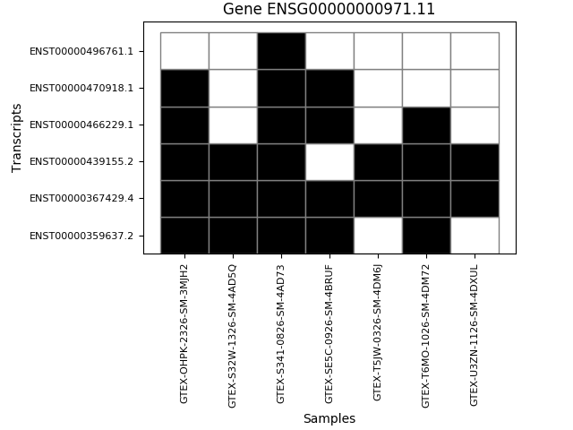
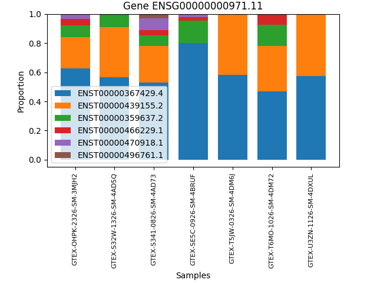
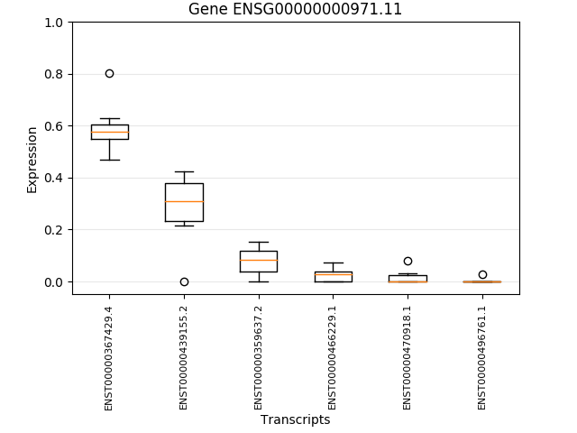
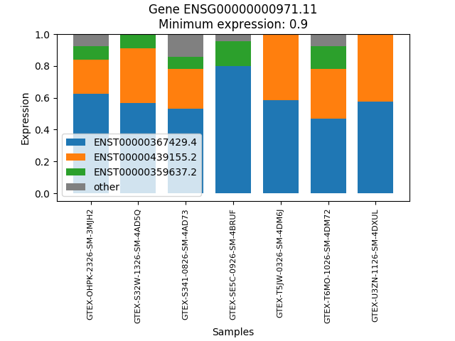

# The gene analysis: `gene_analysis.py`

This file contains several functions to be able to analyse and represent the expression of one unique gene in one unique tissue, but various samples.

These are the all the possible arguments we can use:

| Argument | Type | Default | Description |
|:-|:-:|:-:|:-|
| `--data` | string | - | The *.csv.gz* or *.csv* file where the original tissue data is saved. |
| `--genename` | string | - | The name of the gene you want to analyse. |
| `--genepos` | integer | - | The position of the gene (inside your data) you want to analyse. |
| `--minexp` | float | 0.8 | The minimum expression you want to be explained. Imagine you have a gene with 5 isoforms, and the proportion of each one is 0.18, 0.72, 0.05, 0.02 and 0.13 in one of the samples, respectively. The second isoform explains the 72% of the expression of the gene, which is very high, but maybe you need a minimum of 80% to be explained. In this case, this is what you should write: `--minexp 0.8`. |
| `--minsamps` | integer | 10 | The minimum samples where a gene has to be expressed to take it into account. This threshold is useful when you have a big number of samples. |
| `--plotfile` | string | plots/*genename*_*plottype*.png | The name of the file where the plot will be saved. It can be *.pdf* or *.png*. Note that, if you do not write another name, the program will create (if necessary) a folder called *plots* in you working directory and will save the plot inside it. |

To use **any** function of this program, there are two arguments that are mandatory:

- `--data`
- `--genename` or `--genepos`

You will get an error if you do not write any of theme:

```bash
$ python gene_analysis.py -GP --genename ENSG00000000971.11
usage: gene_analysis.py [-h] --data DATA [--genename GENENAME]
                        [--genepos GENEPOS] [--dftype DFTYPE]
                        [--minexp MINEXP] [--minsamps MINSAMPS]
                        [--plotfile PLOTFILE]
                        [-GN [GENENAMEF [GENENAMEF ...]]]
                        [-GP [GENEPOSF [GENEPOSF ...]]]
                        [-GI [GENEINFO [GENEINFO ...]]]
                        [-GS [GENESTATS [GENESTATS ...]]]
                        [-GFP [GENEFILPROP [GENEFILPROP ...]]]
                        [-GC [GENECLASS [GENECLASS ...]]]
                        [-GBox [GENEBOXPLOT [GENEBOXPLOT ...]]]
                        [-GM [GENEMATRIX [GENEMATRIX ...]]]
                        [-GBar [GENEBARPLOT [GENEBARPLOT ...]]]
                        [-GFB [GENEFILTBARPLOT [GENEFILTBARPLOT ...]]]
gene_analysis.py: error: the following arguments are required: --data
```

```bash
$ python gene_analysis.py -GP --data AllTissues_Initial/SMTS_Fallopian_Tube.csv.gz
ERROR: You must specify the gene you are interested in.
```

Another error will appear if you write the name using the `--genepos` argument...

```bash
$ python gene_analysis.py -GP --data AllTissues_Initial/SMTS_Fallopian_Tube.csv.gz --genepos ENSG00000000971.11
usage: gene_analysis.py [-h] --data DATA [--genename GENENAME]
                        [--genepos GENEPOS] [--dicttype] [--minexp MINEXP]
                        [--minsamps MINSAMPS] [--plotfile PLOTFILE]
                        [-GN [GENENAMEF [GENENAMEF ...]]]
                        [-GP [GENEPOSF [GENEPOSF ...]]]
                        [-GI [GENEINFO [GENEINFO ...]]]
                        [-GS [GENESTATS [GENESTATS ...]]]
                        [-GFP [GENEFILPROP [GENEFILPROP ...]]]
                        [-GC [GENECLASS [GENECLASS ...]]]
                        [-GBox [GENEBOXPLOT [GENEBOXPLOT ...]]]
                        [-GM [GENEMATRIX [GENEMATRIX ...]]]
                        [-GBar [GENEBARPLOT [GENEBARPLOT ...]]]
                        [-GFB [GENEFILTBARPLOT [GENEFILTBARPLOT ...]]]
gene_analysis.py: error: argument --genepos: invalid int value: 'ENSG00000000971.11'
```

... or if you write the position using the `--genename` argument (except in case there was a gene called as a number):

```bash
python gene_analysis.py -GP --data AllTissues_Initial/SMTS_Fallopian_Tube.csv.gz --genename 6
ERROR: The gene 6 is not in your data.
```

## Numeric functions

These are the functions that perform the analysis:

- Gene position (GP)
- Gene name (GN)
- Gene information (GI)
- Gene statistics (GS)
- Gene filtered proportions (GFP)
- Gene classification (GC)

There is one more function in **Functions.py**, called *Gene data*, but it is just to obtain a little part of the information of the gene in order to be used in the other functions, but we did not create a call for that inside the **gene_analysis.py** file because you can obtain the same information and more using the *Gene information* function.

#### Gene position function: `-GP`

This function is useful to know the position of the gene inside your data, what allows you not to have to write a large gene name.

Optional arguments:

*No optional arguments.*

For instance, in the file *SMTS_Fallopian_Tube.csv.gz*, the gene ENSG00000000971.11 is in the 6th position:

```bash
$ python gene_analysis.py -GP --data AllTissues_Initial/SMTS_Fallopian_Tube.csv.gz --genename ENSG00000000971.11
6
```

Note that we wrote the `--genename` argument instead of the `--genepos` one. We could use the second one, but it does not make much sense if you already know the position...

```bash
$ python gene_analysis.py -GP --data AllTissues_Initial/SMTS_Fallopian_Tube.csv.gz --genepos 6
6
```

#### Gene name function: `-GN`

This function does quite the opposite from the gene position function: we can know the name of a gene using its position.

Optional arguments:

*No optional arguments.*

So, using the same example as over, in the file *SMTS_Fallopian_Tube.csv.gz*, the gene in the 6th position is ENSG00000000971.11:

```bash
$ python gene_analysis.py -GN --data AllTissues_Initial/SMTS_Fallopian_Tube.csv.gz --genepos 6
ENSG00000000971.11
```

You can exchange `--genepos` argument for the `--genename` one, but, again, it does not make sense...

```bash
$ python gene_analysis.py -GN --data AllTissues_Initial/SMTS_Fallopian_Tube.csv.gz --genename ENSG00000000971.11
ENSG00000000971.11
```

> **NOTE**: From now on, we will always use the `--genepos` mandatory argument, but you can exchange it for the `--genename` argument and the name of a gene when you want.

#### Gene information function: `-GI`

With this function, you get the information of the gene exactly as you have in your data.

Optional arguments:

*No optional arguments.*

Let's see an example:

```bash
$ python gene_analysis.py -GI --data AllTissues_Initial/SMTS_Fallopian_Tube.csv.gz --genepos 6

ENSG00000000971.11 - CFH ---> protein_coding

                         TranscriptType  GTEX-OHPK-2326-SM-3MJH2  GTEX-S32W-1326-SM-4AD5Q  GTEX-S341-0826-SM-4AD73  GTEX-SE5C-0926-SM-4BRUF  GTEX-T5JW-0326-SM-4DM6J  GTEX-T6MO-1026-SM-4DM72  GTEX-U3ZN-1126-SM-4DXUL
ENST00000359637.2        protein_coding                 0.083466   				 0.090150                 0.074938				   0.153378                 0.000000  				 0.146685                 0.000000
ENST00000367429.4        protein_coding                 0.626797   				 0.565943                 0.531016				   0.801218                 0.584634  				 0.468970                 0.576389
ENST00000439155.2        protein_coding                 0.213858   				 0.343907                 0.250208				   0.000000                 0.415366  				 0.310296                 0.423611
ENST00000466229.1       retained_intron                 0.043730   				 0.000000                 0.033306				   0.026578                 0.000000  				 0.074048                 0.000000
ENST00000470918.1       retained_intron                 0.032149   				 0.000000                 0.081391				   0.018826                 0.000000  				 0.000000                 0.000000
ENST00000496761.1  processed_transcript                 0.000000   				 0.000000                 0.029142				   0.000000                 0.000000  				 0.000000                 0.000000
```

We only keep those samples where the gene is expressed:

```bash
$ python gene_analysis.py -GI --data AllTissues_Initial/SMTS_Fallopian_Tube.csv.gz --genepos 15

ENSG00000001626.10 - CFTR ---> protein_coding

                         TranscriptType  GTEX-S32W-1326-SM-4AD5Q  GTEX-T5JW-0326-SM-4DM6J
ENST00000003084.6        protein_coding                      0.0   					  0.0
ENST00000426809.1        protein_coding                      0.0   					  0.0
ENST00000429014.1  processed_transcript                      0.0   					  1.0
ENST00000446805.1        protein_coding                      0.0   					  0.0
ENST00000454343.1        protein_coding                      1.0   					  0.0
ENST00000468795.1        protein_coding                      0.0   					  0.0
ENST00000472848.1  processed_transcript                      0.0   					  0.0
ENST00000546407.1  processed_transcript                      0.0   					  0.0
ENST00000600166.1        protein_coding                      0.0   					  0.0
ENST00000608965.1  processed_transcript                      0.0   					  0.0
ENST00000610149.1  processed_transcript                      0.0   					  0.0
```

#### Gene statistics function: `-GS`

Gene statistics function performs some statistics of each isoform of the gene, such as the mean, the standard deviation, the quartiles... Then, it orders the data in a descending manner according to the mean of the expression of each isoform.

Optional arguments:

*No optional arguments.*

Let's see an example:

```bash
$ python gene_analysis.py -GS --data AllTissues_Initial/SMTS_Fallopian_Tube.csv.gz --genepos 6

ENSG00000000971.11 - CFH ---> protein_coding

                         TranscriptType      Mean  CumulativeMean  StandardDeviation        Q1    Median        Q3  Minimum    Maximum
ENST00000367429.4        protein_coding  0.593567        0.593567           0.096213  0.548480  0.576389  0.605715  0.46897   0.801218
ENST00000439155.2        protein_coding  0.279607        0.873173           0.135019  0.232033  0.310296  0.379636  0.00000   0.423611
ENST00000359637.2        protein_coding  0.078374        0.951547           0.057013  0.037469  0.083466  0.118418  0.00000   0.153378
ENST00000466229.1       retained_intron  0.025380        0.976927           0.025917  0.000000  0.026578  0.038518  0.00000   0.074048
ENST00000470918.1       retained_intron  0.018909        0.995837           0.028055  0.000000  0.000000  0.025487  0.00000   0.081391
ENST00000496761.1  processed_transcript  0.004163        1.000000           0.010198  0.000000  0.000000  0.000000  0.00000   0.029142
```

#### Gene filtered proportions function: `-GFP`

This function takes the CumulativeMean column of the gene statistics function and stays with those isoforms whose CumulativeMean is lower than the `--minexp` threshold and the first one that exceeds this value. The rest of the genes are compacted in a row called 'other'.

Optional arguments:

* `--minexp`

So, if we look at the statistics of the gene ENSG00000000971.11 and want to know how many isoforms are needed to explain the 90% of the expression of the gene, we get:

```bash
$ python gene_analysis.py -GFP --data AllTissues_Initial/SMTS_Fallopian_Tube.csv.gz --genepos 6 --minexp 0.9

ENSG00000000971.11 - CFH ---> protein_coding

                   TranscriptType      Mean  CumulativeMean    NewMean  NewCumulativeMean
ENST00000367429.4  protein_coding  0.593567        0.593567   0.623791   		 0.623791
ENST00000439155.2  protein_coding  0.279607        0.873173   0.293844   		 0.917635
ENST00000359637.2  protein_coding  0.078374        0.951547  0.0823647   		        1
other                           -  0.048453        1.000000          -   		        -
```

If we do not write the `--minexp` argument, it takes a minimum proportion of 0.8:

```bash
$ python gene_analysis.py -GFP --data AllTissues_Initial/SMTS_Fallopian_Tube.csv.gz --genepos 6

ENSG00000000971.11 - CFH ---> protein_coding

                   TranscriptType      Mean  CumulativeMean    NewMean  NewCumulativeMean
ENST00000367429.4  protein_coding  0.593567        0.593567   0.679781   		 0.679781
ENST00000439155.2  protein_coding  0.279607        0.873173   0.320219   		        1
other                           -  0.126827        1.000000          -   		        -
```

The first two isoforms only explain the 87.3173% of the gene expression, so we need to take the third one.

Now, there are two new columns: NewMean and NewCumulativeMean. We decided to do this because, as we are filtering the data, the total percentage does not make 100, so we recalculate the mean of the expression of each isoform in the new total percentage.

#### Gene classification function: `-GC`

This function uses the gene filtered proportions function results to classifies the gene in:

- **Monoform**: more than the `--minexp` proportion of the gene is explained by 1 isoform.
- **Biform**: more than the `--minexp` proportion of the gene is explained by 2 isoforms.
- **Triform**: more than the `--minexp` proportion of the gene is explained by 3 isoforms.
- **Multiform**: more than the `--minexp` proportion of the gene is explained by 4 or more isoforms.
- **NotExpressed**: the gene is not expressed in any sample.
- **FewSamples**: the number of samples where the gene is expressed is lower than the `--minsamps` threshold.

Optional arguments:

* `--minexp`
* `--minsamps`

Once it has classified the gene, it returns a dataframe with the same data as the gene filtered proportions function, but without the *other* row:

```bash
$ python gene_analysis.py -GC --data AllTissues_Initial/SMTS_Fallopian_Tube.csv.gz --genepos 6 --minexp 0.9 --minsamps 1

ENSG00000000971.11 - CFH, protein_coding ---> Triform


                   TranscriptType      Mean  CumulativeMean   NewMean  NewCumulativeMean
ENST00000367429.4  protein_coding  0.593567        0.593567  0.623791           0.623791
ENST00000439155.2  protein_coding  0.279607        0.873173  0.293844           0.917635
ENST00000359637.2  protein_coding  0.078374        0.951547  0.082365           1.000000
```

In case the gene was not expressed in any sample, it is classified as **NotExpressed**:

```bash
$ python gene_analysis.py -GC --data AllTissues_Initial/SMTS_Fallopian_Tube.csv.gz --genepos 1 --minexp 0.9 --minsamps 1

ENSG00000000005.5 - TNMD, protein_coding ---> NotExpressed
```

In case the gene was expressed in less samples than you wrote in this threshold, it is classified as **FewSamples**:

```bash
$ python gene_analysis.py -GC --data AllTissues_Initial/SMTS_Fallopian_Tube.csv.gz --genepos 6 --minexp 0.9 --minsamps 9

ENSG00000000971.11 - CFH, protein_coding ---> FewSamples
```

## Plot functions

These functions give the same information as some of the over ones, but with plots;

- Gene boxplot (GBox)
- Gene matrix (GM)
- Gene barplot (GBar)
- Gene filtered barplot (GFB)

#### Gene matrix function: `-GM`

This function draws a grid showing all the isoforms as rows and all the samples as columns, painting a square when the isoform of that row is expressed in the sample of that column. Then, it saves the image in a *.png* file.

Optional arguments:

* `--plotfile`

Let's see an example:

```bash
$ python gene_analysis.py -GM --data AllTissues_Initial/SMTS_Fallopian_Tube.csv.gz --genepos 6
```



By default, in this case, the plot file is called *ENSG00000000971.11_Matrix.png*.

#### Gene barplot function: `-GBar`

This function draws a barplot with the isoform expression proportion for each sample, taking the values of the gene information function. Then, it saves the image in a *.png* file.

Optional arguments:

* `--plotfile`

Let's rememeber the original data of the gene ENSG00000000971.11:

```bash
$ python gene_analysis.py -GI --data AllTissues_Initial/SMTS_Fallopian_Tube.csv.gz --genepos 6

ENSG00000000971.11 - CFH ---> protein_coding

                         TranscriptType  GTEX-OHPK-2326-SM-3MJH2  GTEX-S32W-1326-SM-4AD5Q  GTEX-S341-0826-SM-4AD73  GTEX-SE5C-0926-SM-4BRUF  GTEX-T5JW-0326-SM-4DM6J  GTEX-T6MO-1026-SM-4DM72  GTEX-U3ZN-1126-SM-4DXUL
ENST00000359637.2        protein_coding                 0.083466   				 0.090150                 0.074938				   0.153378                 0.000000  				 0.146685                 0.000000
ENST00000367429.4        protein_coding                 0.626797   				 0.565943                 0.531016				   0.801218                 0.584634  				 0.468970                 0.576389
ENST00000439155.2        protein_coding                 0.213858   				 0.343907                 0.250208				   0.000000                 0.415366  				 0.310296                 0.423611
ENST00000466229.1       retained_intron                 0.043730   				 0.000000                 0.033306				   0.026578                 0.000000  				 0.074048                 0.000000
ENST00000470918.1       retained_intron                 0.032149   				 0.000000                 0.081391				   0.018826                 0.000000  				 0.000000                 0.000000
ENST00000496761.1  processed_transcript                 0.000000   				 0.000000                 0.029142				   0.000000                 0.000000  				 0.000000                 0.000000
```

and let's draw the barplot with these data:

```bash
$ python gene_analysis.py -GBar --data AllTissues_Initial/SMTS_Fallopian_Tube.csv.gz --genepos 6
```



By default, in this case, the plot file is called *ENSG00000000971.11_Barplot.png*.

#### Gene boxplot function: `-GBox`

The gene boxplot function draws a boxplot showing the ordered results obtained by the gene statistics function, and saves it in a *.png* file.

Optional arguments:

* `--plotfile`

Let's remember the results of the gene statistics function for the gene ENSG00000000971.11:

```bash
$ python gene_analysis.py -GS --data AllTissues_Initial/SMTS_Fallopian_Tube.csv.gz --genepos 6

ENSG00000000971.11 - CFH ---> protein_coding

                         TranscriptType      Mean CumulativeMean  StandardDeviation        Q1    Median        Q3  Minimum   Maximum
ENST00000359637.2        protein_coding  0.593567       0.593567           0.096213  0.548480  0.576389  0.605715  0.46897  0.801218
ENST00000367429.4        protein_coding  0.279607       0.873173           0.135019  0.232033  0.310296  0.379636  0.00000  0.423611
ENST00000439155.2        protein_coding  0.078374       0.951547           0.057013  0.037469  0.083466  0.118418  0.00000  0.153378
ENST00000466229.1       retained_intron  0.025380       0.976927           0.025917  0.000000  0.026578  0.038518  0.00000  0.074048
ENST00000470918.1       retained_intron  0.018909       0.995837           0.028055  0.000000  0.000000  0.025487  0.00000  0.081391
ENST00000496761.1  processed_transcript  0.004163       1.000000           0.010198  0.000000  0.000000  0.000000  0.00000  0.029142
```

It works like this:

```bash
$ python gene_analysis.py -GBox --data AllTissues_Initial/SMTS_Fallopian_Tube.csv.gz --genepos 6
```



In this case, the name of the plot file is *ENSG00000000971.11_Boxplot.png*.

#### Gene filtered barplot function: `-GFB`

This functions works like the gene barplot one, but just drawing the results of the gene filtered proportions function, including the *other* row:

Optional arguments:

* `--minexp`
* `--plotfile`

Let's rememeber the results after applying the gene filtered proportions function to the gene ENSG00000000971.11:

```bash
$ python gene_analysis.py -GFP --data AllTissues_Initial/SMTS_Fallopian_Tube.csv.gz --genepos 6 --minexp 0.9

ENSG00000000971.11 - CFH ---> protein_coding

                   TranscriptType      Mean  CumulativeMean    NewMean  NewCumulativeMean
ENST00000367429.4  protein_coding  0.593567        0.593567   0.623791           0.623791
ENST00000439155.2  protein_coding  0.279607        0.873173   0.293844           0.917635
ENST00000359637.2  protein_coding  0.078374        0.951547  0.0823647                  1
other                           -  0.048453        1.000000          -                  -
```

So the filtered barplot is:

```bash
$ python gene_analysis.py -GFB --data AllTissues_Initial/SMTS_Fallopian_Tube.csv.gz --genepos 6 --minexp 0.9
```



In this case, the name of the plot file is *ENSG00000000971.11_0.9_FilteredBarplot.png* (being 0.9 the `minexp` argument).